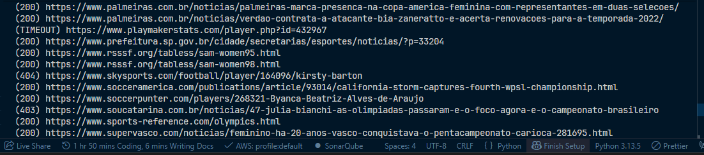

# Create a Python script to get and print the `status code` of the response of a list of URLs from a `.csv` file.

The script in this repo gets and prints the status code of the response of a list of URLs from a .csv file.

## The Thought Process behind some choices I made

- I assumed that the csv file could contain malformed urls. I added a validation step using `urlparse`.

- Opening a new TCP connection for every single URL is slow. I took a look at the csv file and saw multiple subdomains and paths from the same root providers. I used `requests.Session` wrapped in thread-local storage. When the worker moves from one URL to another on the same server, it reuses the existing socket.

- I implemented a `ThreadPoolExecutor` to fire off multiple requests in parallel. While one thread waits for a response from a lagging server (if any), nine other workers continue processing the rest of the list.

- I assumed a url could be none existent, so I implemented error messages to give an insight into what happened with the request.

Here is the output of the script:

